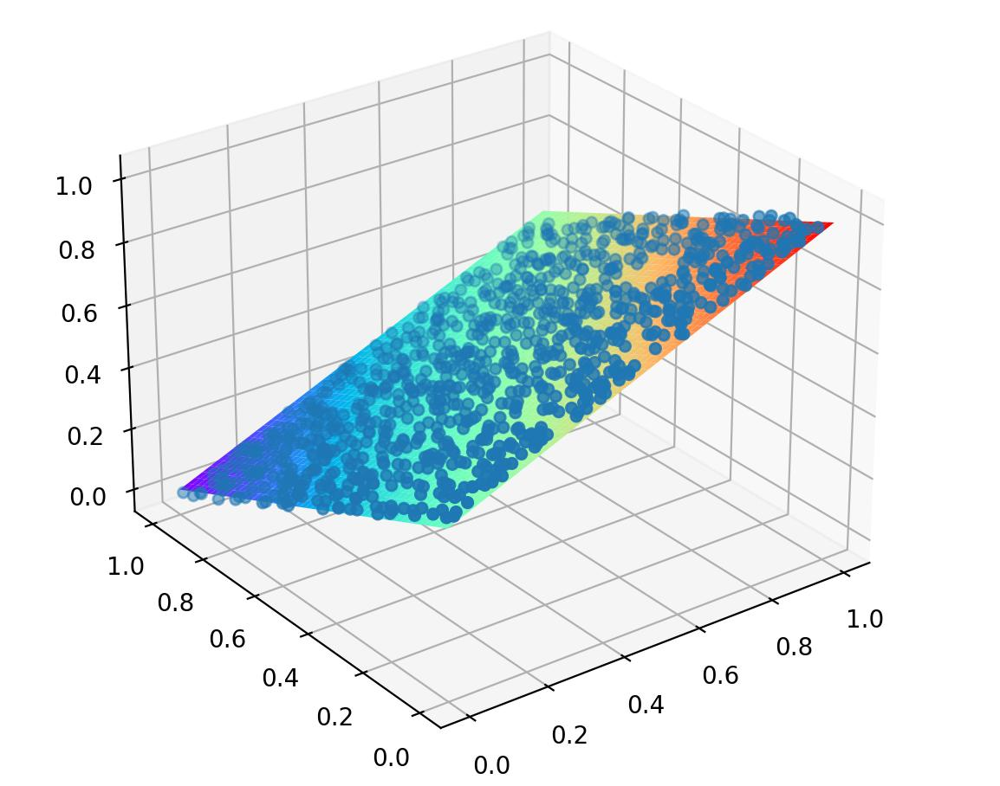
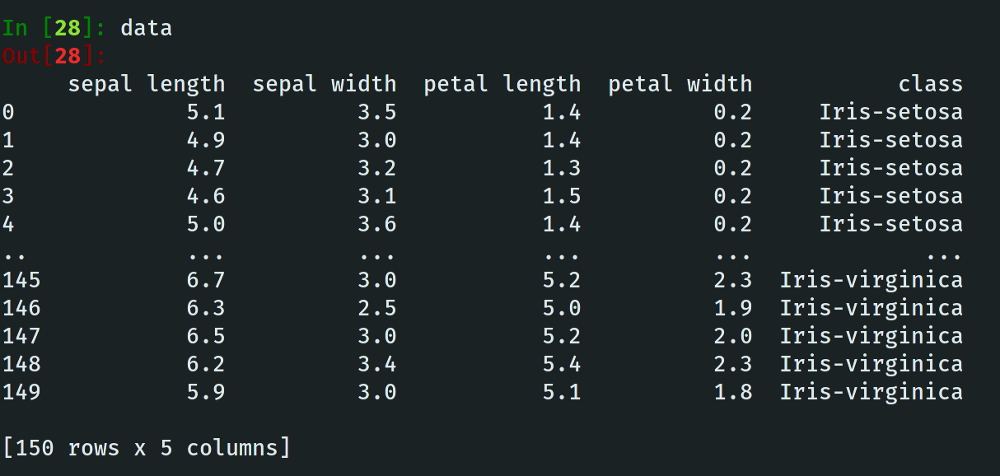

# Microsoft Neural Network Homework Report

~~王樾 华南理工大学~~

本报告含LaTeX公式，以获得更好观看体验。

## Easy：线性回归模型

给定含有1000条记录的数据集`mlm.csv`，其中每条记录均包含两个自变量`x`,`y`和一个因变量`z`，它们之间存在较为明显的线性关系。

**任务：请对数据进行三维可视化分析，并训练出良好的线性回归模型。**

### 所使用的库

- `numpy`：用于矩阵运算
- `pandas`：用于csv文件数据读取
- `matplotlib.pyplot`：用于画平面图
- `mpl_toolkits.mplot3d.axes3d`：用于画立体图

### 神经网络框架


### 数学公式


### 核心代码

```python
reader = DataReader(file_name)
reader.readData()
# print(reader.xRaw)
reader.normalizeX()
reader.normalizeY()
# print(reader.xTrain)
params = HyperParameters(2, 1, eta=0.1, max_epoch=100, batch_size=5, eps=1e-4)
neural = NeuralNet(params)
neural.train(reader, 0.1)

showResult(reader, neural)
```

### 实验结果

$$w_1=0.53341357, w_2=-0.45504689,b=0.46714201$$

$$\hat z = w_1x+w_2y+b$$

$loss=8.21699533763025 \times 10^{-5}$


### Remark








## Medium：非线性多分类器

鸢尾花数据集`iris.csv`含有150条记录，每条记录包含萼片长度`sepal length`、萼片宽度`sepal width`、 花瓣长度`petal length`和花瓣宽度`petal width`四个数值型特征，以及它的所属类别`class`（可能为`Iris-setosa`,`Iris-versicolor`,`Iris-virginica`三者之一）。

**任务：请利用该数据集训练出一个良好的非线性分类器。**

### 所使用的库


### 神经网络框架

我们采用如下的神经网络：


### 数学公式


### 核心代码


### 实验结果


### Remark

- 由于该题数据集规模过小，刻意划分出测试集意义不大，所以最后只划分出了$10\%$的数据独立作为验证集，剩下$90\%$的数据都作为训练集，省略了测试的部分，实际分类的精确度会略低些。
- 

```
loss_vld=0.009721, accuracy_vld=1.000000
wb1.W =  [[ 0.64530232  0.5390862  -0.27046767  1.1550556 ]
 [-1.06601317  1.83834277 -2.93819757  0.98059026]
 [ 2.03141608 -3.3508914   3.80055151 -4.44390533]
 [ 2.73443447 -4.13001443  4.54834597 -4.56511065]]
wb1.B =  [[-2.27881806  3.42598145 -2.06566508  4.72878502]]
wb2.W =  [[-3.24263775 -0.55818033  3.9250059 ]
 [ 4.59566756  0.59906731 -6.98916562]
 [-8.86752225  0.93443894  7.31638705]
 [ 3.84608092  2.21261136 -7.82706791]]
wb2.B =  [[ 0.29928701  0.64216304 -0.94145005]]
```

