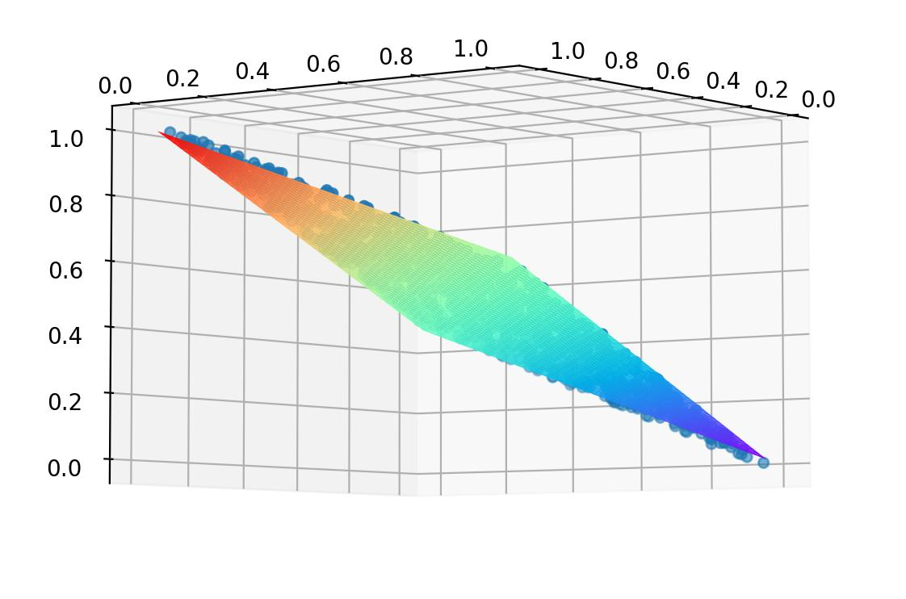

# Microsoft Neural Network Homework Report

~~王樾 华南理工大学~~

由于本人神经网络学习刚刚入门，大部分代码实现都参照了官方Tutorial。

本报告含LaTeX公式，在本地查看或安装插件以获得更好阅读体验。

## Easy：线性回归模型

给定含有1000条记录的数据集`mlm.csv`，其中每条记录均包含两个自变量`x`,`y`和一个因变量`z`，它们之间存在较为明显的线性关系。

**任务：请对数据进行三维可视化分析，并训练出良好的线性回归模型。**


### 所使用的库

- `numpy`：用于矩阵运算
- `pandas`：用于csv文件数据读取
- `matplotlib.pyplot`：用于画平面图
- `mpl_toolkits.mplot3d.axes3d`：用于画立体图

### 神经网络框架


### 数学公式

正向：

$XW + B = Z$

反向：

$dZ = Z - Y$

$dW=X^TdZ$

$dB = dZ$

### 核心代码

```python
reader = DataReader(file_name)
reader.readData()
# print(reader.xRaw)
reader.normalizeX()
reader.normalizeY()
# print(reader.xTrain)
params = HyperParameters(2, 1, eta=0.1, max_epoch=100, batch_size=5, eps=1e-4)
neural = NeuralNet(params)
neural.train(reader, 0.1)

showResult(reader, neural)
```

### 实验结果

损失随迭代次数的变化如下：


可见原数据的线性相关性非常强，只用了350次迭代就达到了$10^{-4}$的精度要求。


最终求出的参数如下：

```
W =  [[ 0.53253086]
 [-0.45795353]]
B =  [[0.46695331]]
loss = 7.518152559389166e-05
```


三维可视化结果如下：




平面几乎拟合了所有点，说明我们的模型训练得非常准确。

### Remark

本数据线性相关性非常强，所以不需要进行很多次的迭代。


## Medium：非线性多分类器

鸢尾花数据集`iris.csv`含有150条记录，每条记录包含萼片长度`sepal length`、萼片宽度`sepal width`、 花瓣长度`petal length`和花瓣宽度`petal width`四个数值型特征，以及它的所属类别`class`（可能为`Iris-setosa`,`Iris-versicolor`,`Iris-virginica`三者之一）。

**任务：请利用该数据集训练出一个良好的非线性分类器。**


### 所使用的库


### 神经网络框架

我们采用如下的神经网络：


### 数学公式

正向：

$XW_1+B_1=Z_1$

$Sigmoid(Z1) = A_1$

$A_1W_2+B_2=Z_2$

$Softmax(Z_2)=A_2$

反向：

$dZ_2=A_2-Y$

$dW_2=A_1^TdZ_2$

$dB_2=dZ_2$

$dA_1=dZ_2W_2^T$

$dZ_1=dA_1 \odot A_1 \odot (1-A_1)$

$dW_1=X^TdZ_1$

$dB_1=dZ_1$


### 代码实现


```python
reader = DataReader(train_file_name)
reader.ReadData()
reader.NormalizeY(NetType.MultipleClassifier, base=1)
reader.NormalizeX()
reader.GenerateValidationSet()

num_input = reader.num_feature
num_hidden = 4
num_output = reader.num_category
eta = 0.1
max_epoch = 10000
batch_size = 5
eps = 1e-2
params = HyperParameters(num_input, num_hidden, num_output, eta, max_epoch, batch_size, eps, NetType.MultipleClassifier, InitialMethod.Xavier)
net = NeuralNet(params, "iris_443")
net.train(reader, 10)
net.ShowTrainingHistory()
```


### 实验结果

误差与精确度随迭代次数的变化如下：


参数结果如下：

```
loss_vld=0.009721, accuracy_vld=1.000000
wb1.W =  [[ 0.64530232  0.5390862  -0.27046767  1.1550556 ]
 [-1.06601317  1.83834277 -2.93819757  0.98059026]
 [ 2.03141608 -3.3508914   3.80055151 -4.44390533]
 [ 2.73443447 -4.13001443  4.54834597 -4.56511065]]
wb1.B =  [[-2.27881806  3.42598145 -2.06566508  4.72878502]]
wb2.W =  [[-3.24263775 -0.55818033  3.9250059 ]
 [ 4.59566756  0.59906731 -6.98916562]
 [-8.86752225  0.93443894  7.31638705]
 [ 3.84608092  2.21261136 -7.82706791]]
wb2.B =  [[ 0.29928701  0.64216304 -0.94145005]]
```

### Remark

由于数据的feature数是4，我们就没办法用5维的空间去可视化了。

由于规模小，参数的选择比较随意，不保证超参是最优的。

并且值得一提的是，由于该题数据集规模过小，刻意划分出测试集意义不大，所以最后只划分出了$10\%$的数据独立作为验证集，剩下$90\%$的数据都作为训练集，省略了测试的部分，投入实际进行分类的精确度会低些。这种想法可以通过打印出所有数据经过模型后得到的正确概率来得到验证：

```
 [0.99130898]
 [0.98827269]
 [0.99011894]
 [0.98857813]
 [0.99168173]
 [0.99068561]
 [0.98989251]
 [0.99058757]
 [0.98716876]
 [0.98989005]
 [0.99181028]
 [0.99026042]
 [0.98960963]
 [0.99059636]
 [0.99295396]
 [0.9926344 ]
 [0.99165477]
 [0.99049101]
 [0.99104832]
 [0.99152998]
 [0.98995514]
 [0.99028142]
 [0.99240538]
 [0.98330096]
 [0.98912442]
 [0.98715831]
 [0.98766104]
 [0.99106177]
 [0.99088091]
 [0.98893066]
 [0.98810692]
 [0.98825264]
 [0.99315968]
 [0.99309845]
 [0.98989005]
 [0.99046905]
 [0.99153451]
 [0.98989005]
 [0.98867539]
 [0.99059183]
 [0.99078183]
 [0.9700406 ]
 [0.99008691]
 [0.98460605]
 [0.98944876]
 [0.98644694]
 [0.9919411 ]
 [0.98974654]
 [0.99181265]
 [0.99037358]
 [0.99281323]
 [0.98847732]
 [0.95901923]
 [0.98477262]
 [0.93978721]
 [0.987763  ]
 [0.95650301]
 [0.9664225 ]
 [0.99283083]
 [0.99053573]
 [0.99371053]
 [0.98750846]
 [0.9944034 ]
 [0.96890823]
 [0.98280538]
 [0.99348298]
 [0.9561046 ]
 [0.97919887]
 [0.66372379]
 [0.99155536]
 [0.53347754]
 [0.99328923]
 [0.59673154]
 [0.9921923 ]
 [0.99379079]
 [0.99297422]
 [0.96476471]
 [0.54176782]
 [0.9548084 ]
 [0.94725887]
 [0.99255765]
 [0.98381841]
 [0.9907875 ]
 [0.70220514]
 [0.94784755]
 [0.98080454]
 [0.9758816 ]
 [0.96934841]
 [0.99110102]
 [0.9916762 ]
 [0.99131062]
 [0.98451398]
 [0.99381874]
 [0.97589307]
 [0.99211577]
 [0.98698864]
 [0.9932279 ]
 [0.99368767]
 [0.94955835]
 [0.99362897]
 [0.99914501]
 [0.97203933]
 [0.99489859]
 [0.96374419]
 [0.99728875]
 [0.99816801]
 [0.79691201]
 [0.98781138]
 [0.98872598]
 [0.99854077]
 [0.92149394]
 [0.97496757]
 [0.98980519]
 [0.98924319]
 [0.99811882]
 [0.99436083]
 [0.92876951]
 [0.9962044 ]
 [0.99956755]
 [0.76548312]
 [0.9966836 ]
 [0.97444744]
 [0.99810505]
 [0.8543934 ]
 [0.98826274]
 [0.94899222]
 [0.77251357]
 [0.72970678]
 [0.99557479]
 [0.76239904]
 [0.99122911]
 [0.96905561]
 [0.99735558]
 [0.67533326]
 [0.71058451]
 [0.99825063]
 [0.99738973]
 [0.91330602]
 [0.67728403]
 [0.98271003]
 [0.99810437]
 [0.99061474]
 [0.97203933]
 [0.99776569]
 [0.99857492]
 [0.9945073 ]
 [0.9686047 ]
 [0.96472543]
 [0.99379718]
 [0.85996964]
```

在上述概率中，绝大多数都是$98\%$或$99\%$，很好地完成了分类，但是其中也不乏$54\%$、$66\%$、$70\%$的样本存在，这也说明我们的模型在数据更多的时候会有提升的空间。
